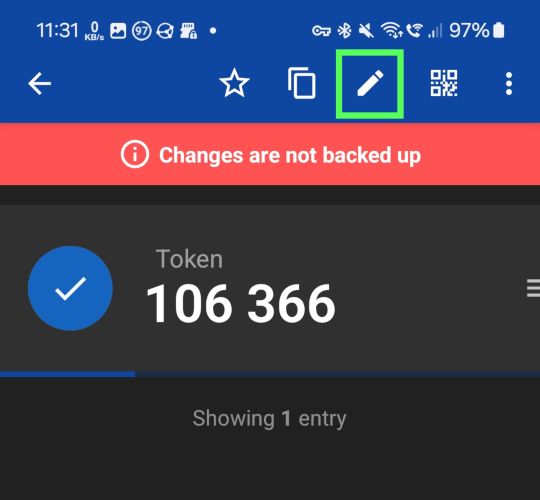
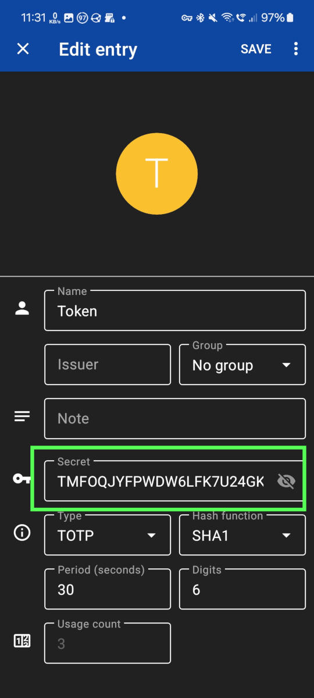
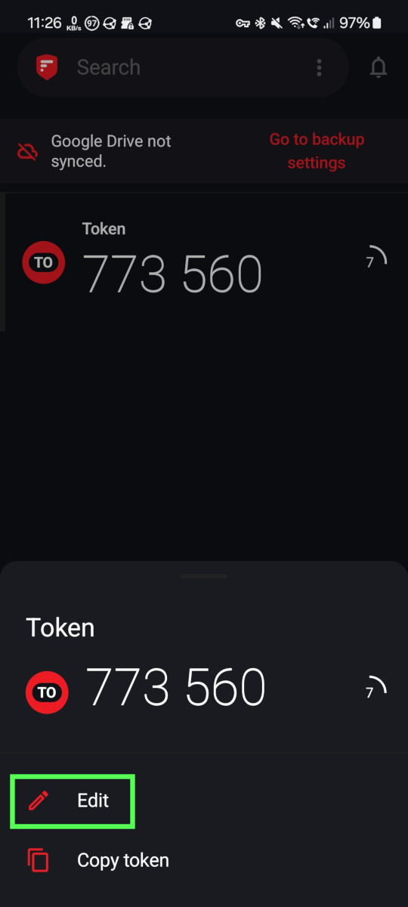
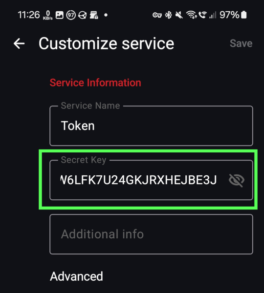

# Zwei-Faktor-Authentifizierung (2FA) in TUfast
Stand: 09.02.2024

### Informationen zu 2FA
Die Idee der Zwei-Faktor-Authentifizierung ist deinen Login sicherer zu gestalten. Dabei kommt neben deinem normalen Passwort ein **Zweiter Faktor** zum Einsatz, den du bei der Anmeldung mit eingeben musst. \
Das Konzept von 2FA ist:
- etwas, das du weißt: dein normales Passwort 
- etwas, das du hast: bspw. dein Handy, welches dir bei jeder Anmeldung ein zusätzliches einmaliges Passwort generiert

Mehr Informationen zu 2FA-Tokens und wie du dein Token erstellst findest du auf der [Seite vom ZIH](https://faq.tickets.tu-dresden.de/otrs/public.pl?Action=PublicFAQZoom;ItemID=872).

## 2FA mit TUfast
**TUfast kann den AutoLogin auch mit 2FA durchführen.** Um diese Funktion zu nutzen gibt es zwei Möglichkeiten

1) TUfast kann (auf Nachfrage) bereits bei Einrichtung von 2FA auf der ZIH-Website deinen 2FA Token abspeichern. Falls du dem zustimmst ist die Einrichtung schon abgeschlossen.

2) Möchtest du TUfast auf mehreren Rechnern verwenden oder die 2FA anmeldung aktivieren _nachdem_ du 2FA beim ZIH bereits eingerichtet hast, musst du dies manuell tun. Dafür musst du deinen TOTP-Token in TUfast hinterlegen. Wie das geht, ist im folgenden Abschnitt erklärt.

### Manuelle Einrichtung: TOTP (Time based one-time password) hinterlegen
Das TOTP Token solltest du bei der Erstellung über einen QR-Code von der ZIH Webseite mit einer Authenticator App auf deinem Handy gescannt haben.
Im Nachfolgenden ist für eine Auswahl von Apps beschrieben, wie du das Token anzeigen kannst, um es dann in TUfast einzutragen. 

### [Aegis](https://getaegis.app/) (empfohlen)
1. auf dem Hauptbildschirm der App hältst du auf dem Token gedrückt bis das Menü in der Kopfzeile der App aufgeht

2. drück auf den Stift und auf der nächsten Seite auf "Advanced" (ganz unten)
3. bei dem Feld "Secret" drückst du rechts auf das Augensymbol

4. dieses Secret musst du jetzt in das TOTP Feld in der "Automatisches Anmelden" Seite von TUfast eingeben
5. **das Token ist 32 Zeichen lang, du wirst nicht alle Zeichen direkt sehen und musst wahrscheinlich noch mit dem Cursor nach rechts gehen in dem Feld; sei dabei vorsichtig nichts in dem Feld zu bearbeiten ansonsten funktioniert dein ganzes Token nicht mehr**
6. geh dann oben links auf das Kreuz, sodass sich das Bearbeitungsfenster wieder schließt (Falls die App dich fragt ob du Änderungen verwerfen willst, hast du irgendwo ausversehen etwas geändert. Geh dann auf "Verwerfen" und mach das ganze nochmal um sicherzustellen, dass du dich bei dem Secret nicht verschrieben hast)

### [2FAS](https://2fas.com/)
1. auf dem Hauptbildschirm der App hältst du auf dem Token gedrückt bis von der Unterseite des Bildschirms ein Menü aufgeht

2. geh dort auf "Bearbeiten" und im nächsten Fenster bei dem Feld "Secret Key" auf das Augensymbol
3. die App wird dich dazu auffordern eine PIN oder Fingerabdruck hinzuzufügen um dieses Feld anzeigen zu können, falls du dies noch nicht gemacht hast, folg dazu den Anweisungen der App und komm zu dieser Seite zurück

4. diesen "Secret Key" musst du jetzt in das TOTP Feld in der "Automatisches Anmelden" Seite von TUfast eingeben
5. **das Token ist 32 Zeichen lang, du wirst nicht alle Zeichen direkt sehen und musst das Feld noch nach links schieben um den Rest zu sehen**
6. danach gehst du oben links wieder auf den Zurückpfeil

### Google Authenticator (nur eingeschränkt empfohlen)
Google Authenticator zeigt dir deinen geheimen Schlüssel des Tokens nicht direkt an. Theoretisch könntest du mit [diesem](https://github.com/scito/extract_otp_secrets) Projekt die Schlüssel dennoch exportieren. Am einfachsten ist es jedoch wenn du dir im ZIH Portal ein neues Token (dabei wird dein altes Token ungültig) erstellt und dann eine der oben genannten Apps (Aeris oder 2FAS) benutzt.

### privacyIDEA Authenticator (nicht empfohlen)
Die App bietet weder die Möglichkeit den geheimen Schlüssel deines Tokens anzuzeigen, noch deine Tokens zu exportieren. Erstelle dir im ZIH Portal ein neues Token (dabei wird dein altes Token ungültig) und benutze bitte eine der oben genannten Apps.

## Sicherheitshinweis
Bitte beachte, dass das Umgehen der 2FA natürlich den eigentlichen Sinn einer 2FA umgeht. Mir dieser Funktion tauschst du Sicherheit gegen Komfort ein.